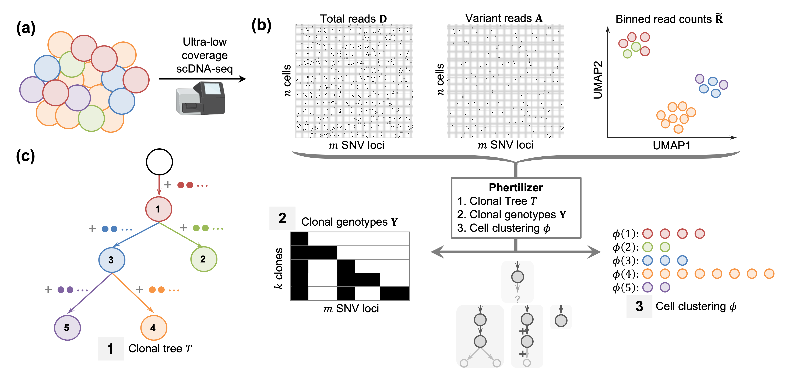

## Phertilizer: growing a clonal tree from ultra-low coverage single-cell DNA sequencing data of tumors



Phertilizer infers a clonal tree with SNV and CNA genotypes given ultra-low coverage single-cell sequencing data.
(a) A tumor is composed of groups of cells, or clones with distinct genotypes.
(b) Ultra-low coverage single-cell DNA seequencing produces total read counts and variant read countsfor n cells and m SNV loci, and read-depth ratios for the same cells for an input set of bins.
(c) Phertilizer infers a cell clustering, SNV genotypes, CNA genotypes and a clonal tree  with maximum posterior probability.


## Contents

  1. [Installation](#install)
     * [Using github](#compilation)
          * [Dependencies](#pre-requisites)
  2. [Usage instructions](#usage)
     * [Modes](#modes)    
     * [I/O formats](#io)
     * [CNA Mode](#cna-mode)

<a name="install"></a>

## Installation

  1. Clone the repository
      ```bash
            $ git clone https://github.com/elkebir-group/phertilizer.git

<a name="pre-requisites"></a>
#### Pre-requisites
+ python3 (>=3.7)
+ [numpy](https://numpy.org/doc/)
+ [pandas](https://pandas.pydata.org/pandas-docs/stable/index.html)
+ [numba](http://numba.pydata.org)
+ [scipy](https://scipy.org)
+ [networkx](https://networkx.org)
+ [sklearn.cluster](https://scikit-learn.org/stable/modules/clustering.html#clustering)
+ [pickle](https://docs.python.org/3/library/pickle.html)
+ [pygrahpviz](https://pygraphviz.github.io)

<a name="usage"></a>
## Usage


<a name="modes"></a>
### Modes
Phertilizer can be run in two modes:
 1. *CNA Mode* 
    + Input: variant/total read counts, binned read counts for tumor cells, binned read counts for normal cells, mapping of SNVs to bin 
    + Phertilizer returns a clonal tree, a cell clustering and **both SNV and CNA genotypes**
 2. *SNV Mode* 
    + Input: variant/total read counts, binned read counts for tumor cells 
    + Phertilizer returns a clonal tree, a cell clustering and **only SNV genotypes** 


<a name="cna-mode"></a>
#### CNA Mode
<a name="io"></a>
##### IO Formats
The input for Phertilizer in CNA Mode consists of four text based file:
  1. A tab or comma separated dataframe with unlabeled columns: chr snv cell variant_reads total_reads
  2. A tab or comma separated dataframe for binned reads counts for tumor cells with labeled columns: cell bin1 bin2 ... binl   
     **Note: cell ids in binned read counts file should exactly match cell ids in the variant reads dataframe**
  3. A tab or comma separated dataframe for binned reads counts for normal cells with labeled columns cell bin1 bin2 ... binl    
     **Note: bin ids in file should exactly match binned read counts for tumor cells file**
  4. A comma separated dataframe with unlabeled columns: snv chr bin
 
See `example/input` for examples of all input files.  

The ouput file options include:  
  1. A png of the clonal tree with maximum posterior probability
  2. A dataframe mapping cells to nodes
  3. A dataframe mappping SNVs to nodes
  4. A dataframe containing the CNA genotypes
  5. A pickle file of the ouput clonal tree
  6. A pickle file containing a ClonalTreeList of all enumerated clonal trees
  7. A dataframe mapping the internal Phertilizer cell indices to cell labels
  8. A  dataframe mapping the internal Phertilizer SNV indices to cell labels

See `example/output` for examples of output files 1 through 4.   

##### CNA Mode Usage
    usage: run_phertilizer.py [-h] [-f FILE] [--bin_count_data BIN_COUNT_DATA] [--bin_count_normal BIN_COUNT_NORMAL]
                              [--snv_bin_mapping SNV_BIN_MAPPING] [-a ALPHA] [--min_cells MIN_CELLS] [--min_snvs MIN_SNVS]
                              [--min_frac MIN_FRAC] [-j ITERATIONS] [-s STARTS] [-d SEED] [--npass NPASS] [--radius RADIUS]
                              [-c COPIES] [--neutral_mean NEUTRAL_MEAN] [--neutral_eps NEUTRAL_EPS] [-m PRED_MUT]
                              [-n PRED_CELL] [-e PRED_EVENT] [--tree TREE] [--tree_pickle TREE_PICKLE] [--tree_path TREE_PATH]
                              [--tree_list TREE_LIST] [--cell_lookup CELL_LOOKUP] [--mut_lookup MUT_LOOKUP] [-v]

    optional arguments:
      -h, --help            show this help message and exit
      -f FILE, --file FILE  input file for variant and total read counts with unlabled columns: [chr snv cell base var total]
      --bin_count_data BIN_COUNT_DATA
                            input binned read counts with headers containing bin ids
      --bin_count_normal BIN_COUNT_NORMAL
                            input binned read counts for normal cells with identical bins as the bin count data
      --snv_bin_mapping SNV_BIN_MAPPING
                            a comma delimited file with unlabeled columns: [snv chr bin]
      -a ALPHA, --alpha ALPHA
                            per base read error rate
      --min_cells MIN_CELLS
                            smallest number of cells required to form a clone
      --min_snvs MIN_SNVS   smallest number of SNVs required to form a cluster
      --min_frac MIN_FRAC   smallest proportion of total cells(snvs) needed to form a cluster, if min_cells or min_snvs are
                            given, min_frac is ignored
      -j ITERATIONS, --iterations ITERATIONS
                            maximum number of iterations
      -s STARTS, --starts STARTS
                            number of restarts
      -d SEED, --seed SEED  seed
      --npass NPASS
      --radius RADIUS
      -c COPIES, --copies COPIES
                            max number of copies
      --neutral_mean NEUTRAL_MEAN
                            center of neutral RDR distribution
      --neutral_eps NEUTRAL_EPS
                            cutoff of neutral RDR distribution
      -m PRED_MUT, --pred-mut PRED_MUT
                            output file for mutation clusters
      -n PRED_CELL, --pred_cell PRED_CELL
                            output file cell clusters
      -e PRED_EVENT, --pred_event PRED_EVENT
                            output file cna genotypes
      --tree TREE           output file for png (dot) of Phertilizer tree
      --tree_pickle TREE_PICKLE
                            output pickle of Phertilizer tree
      --tree_path TREE_PATH
                            path to directory where pngs of all trees are saved
      --tree_list TREE_LIST
                            pickle file to save a ClonalTreeList of all generated trees
      --cell_lookup CELL_LOOKUP
                            output file that maps internal cell index to the input cell label
      --mut_lookup MUT_LOOKUP
                            output file that maps internal mutation index to the input mutation label
      -v, --verbose         Be verbose

<a name="phertilizer"></a>
##### CNA Mode Example

Here we show an example of how to run `Phertilizer`.
The input files are located in the `example/input` directory.


    $ python cna_mode/run_phertilizer.py -f example/input/variant_counts.tsv  \
      --bin_count_data example/input/binned_read_counts.csv \
      --bin_count_normal example/input/normal_cells.tsv --snv_bin_mapping example/input/snv_bin_mapping.csv \
      --min_cells 100 --min_snvs 100 -d 14 --tree example/output/tree.png -n example/output/cell_clusters.csv \
      -m example/output/SNV_clusters.csv -e example/output/CNA_genotypes.csv 

This command generates output files `tree.png`, `cell_clusters.csv`, `SNV_clsuters.csv` and `CNA_genotypes.csv` in directory `example\output`.
